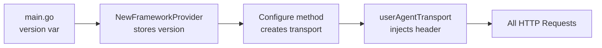

# User-Agent Header Implementation Plan

## Overview

Implement a custom HTTP transport that automatically injects a User-Agent header into all API requests made by the provider. This will enable tracking of provider usage in your SaaS platform analytics.

## User-Agent Format

```
terraform-provider-rundeck/<version> (go<go-version>; <os>)
```

Example: `terraform-provider-rundeck/1.1.2 (go1.24; darwin)`

## Implementation Strategy

### 1. Create HTTP Transport Wrapper

Create a new file `rundeck/http_transport.go` with:

- **Custom RoundTripper**: Implements `http.RoundTripper` interface
- **Header Injection**: Adds User-Agent to every outgoing request
- **Version Detection**: Uses provider version from `main.go`
- **Runtime Info**: Includes Go version and OS from `runtime` package

**Key Implementation Details:**

```go
type userAgentTransport struct {
    base      http.RoundTripper
    userAgent string
}

func (t *userAgentTransport) RoundTrip(req *http.Request) (*http.Response, error) {
    req.Header.Set("User-Agent", t.userAgent)
    return t.base.RoundTrip(req)
}
```

### 2. Update Provider Configuration

Modify `[rundeck/provider_framework.go](rundeck/provider_framework.go)` in the `Configure` method:

**For V1 Client** (line ~158):

- Create custom HTTP client with User-Agent transport
- Assign to `clientV1.Client` before setting authorizer
- V1 client exposes its HTTP client as `cl.Client`

**For V2 Client** (line ~162):

- Configure `cfg.HTTPClient` with custom transport
- OpenAPI clients accept custom HTTP client via configuration
- Set before creating the API client instance

**For Token Generation** (existing `_getToken` function):

- Update `[rundeck/token.go](rundeck/token.go)` to accept optional User-Agent
- Apply same transport wrapper to the token HTTP client (line ~105)

### 3. Version Information Flow




**Version Handling:**

- `main.go`: Sets version ("dev" locally, actual version in releases)
- `frameworkProvider.version`: Stores provider version
- `Configure()`: Passes version to transport builder
- Transport: Uses version in every request

### 4. Client Modification Points

**V1 Client Setup** (lines 157-159 in provider_framework.go):

```go
// BEFORE:
clientV1 := rundeck.NewRundeckWithBaseURI(apiURL.String())
clientV1.Authorizer = &auth.TokenAuthorizer{Token: token}

// AFTER:
clientV1 := rundeck.NewRundeckWithBaseURI(apiURL.String())
clientV1.Client = newHTTPClientWithUserAgent(p.version)  // Custom HTTP client
clientV1.Authorizer = &auth.TokenAuthorizer{Token: token}
```

**V2 Client Setup** (lines 162-166):

```go
// BEFORE:
cfg := openapi.NewConfiguration()
cfg.Host = apiURL.Host
cfg.Scheme = apiURL.Scheme

// AFTER:
cfg := openapi.NewConfiguration()
cfg.Host = apiURL.Host
cfg.Scheme = apiURL.Scheme
cfg.HTTPClient = newHTTPClientWithUserAgent(p.version)  // Custom HTTP client
```

**Token Client** (line 105 in token.go):

```go
// BEFORE:
client := &http.Client{
    Jar: jar,
}

// AFTER:
client := &http.Client{
    Jar: jar,
    Transport: newUserAgentTransport(nil, version),  // Add transport
}
```

### 5. Testing Approach

**Unit Tests:**

- Create `rundeck/http_transport_test.go`
- Verify User-Agent header format
- Test with different provider versions
- Ensure original request is not mutated

**Integration Tests:**

- Capture actual requests in existing tests
- Verify User-Agent appears in all Rundeck API calls
- Test both V1 and V2 client requests
- Verify token generation requests include header

**Manual Verification:**

- Run provider against development Rundeck instance
- Check server logs for User-Agent headers
- Verify format matches specification

## Benefits

1. **SaaS Analytics**: Track which provider versions are being used
2. **Usage Patterns**: Identify adoption rates of new versions
3. **Support**: Correlate issues with specific versions
4. **Platform Insights**: Understand OS/Go version distribution
5. **Minimal Overhead**: No performance impact, header-only change
6. **Future-Proof**: Works with any SDK updates since it operates at HTTP layer

## Files to Modify

- `rundeck/http_transport.go` (NEW) - Transport implementation and builder
- `rundeck/provider_framework.go` - Apply transport to V1 and V2 clients
- `rundeck/token.go` - Apply transport to token HTTP client
- `rundeck/http_transport_test.go` (NEW) - Unit tests

## Design Decisions

**Why HTTP Transport Wrapper:**

- Works seamlessly with both V1 and V2 SDK clients
- SDK-agnostic approach - operates at HTTP layer
- Single implementation point for all API requests
- Easy to maintain and no dependency on SDK internals
- Will continue working if/when V1→V2 SDK migration happens

## Future Opportunities

Once implemented, potential enhancements include:

- **Terraform Version**: Detect and include parent Terraform version
- **V2 SDK Migration**: Transport wrapper already supports both SDKs, making future V1→V2 migration easier
- **Extended Metadata**: Add custom fields for enterprise features or deployment environment (with user opt-in)

